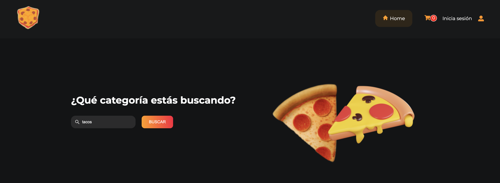
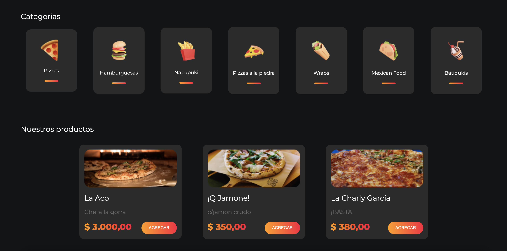
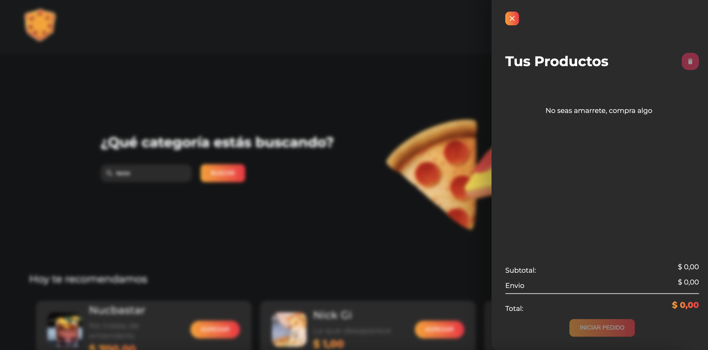

<h2 align="start"> &#127829; Nuca-zapi &#127829;</h2> 

<h3 align="start">Lenguajes, herramientas y librerías utilizadas para el proyecto: </h3> 

Primeros pasos con <strong>React.</strong> Es un proyecto trabajado en la carrera <strong> Full Stack </strong>  
Se trata de una landing page de fast food que permite registrarse en el sitio, iniciar sesión para concretar una compra o bien filtrar por las categorias deseadas distintos tipos de comidas.

<h4>	&#128640; Herramientas de desarrollo y ejecución:</h4

- Me sirvo de Node.js como entorno de ejecución.
- Vite.js me ofrece un entorno de desarrollo rápido y liviano.

<h4>	&#128450; Librerías utilizadas en el proyecto: </h4>

- <strong>Styled Component</strong> para el manejo de estilos.
- <strong>Formik</strong> y <strong>Yup</strong> para validación de formularios. 
- <strong> Framemotion</strong> para animaciones. 
- <strong>Fontsource</strong> para la tipografía.
- <strong>Axios</strong> para controlar las ordenes y el login de usuarios. 

<h4>	&#128285; Hooks de <strong>React</strong> utilizados para mejorar estados globales de la landing:</h4>

- useContext
- useEffect 

Y también utilizo <strong> Redux </strong> para trabajar mediantes slices los estados del cart, categories, orders, products, recommended and user´s. 

<h4>&#129305; Diseño de la landing:</h4>

- Diseño propuesto por el bootcamp, yo he realizado pequeñas modificaciones en base a gustos y preferencias.

<h4>&#128248; Screens:</h4>

Hero

 

Productos y categorias 

 
Cart

  

El proyecto se encuentra desplegado en <b>Vercel</b>, puedes encontrarlo <a href="https://nuca-zapi.vercel.app/" target="_blank" rel="noopener noreferrer">aquí</a>.
